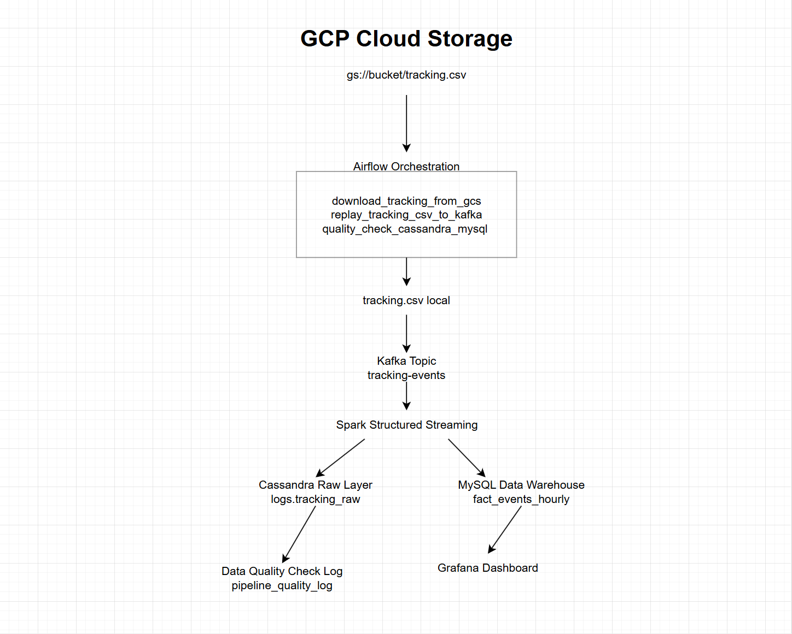
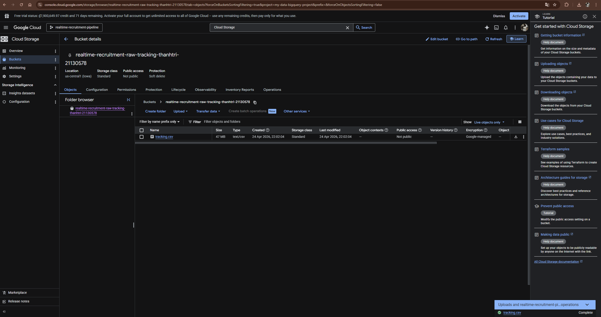
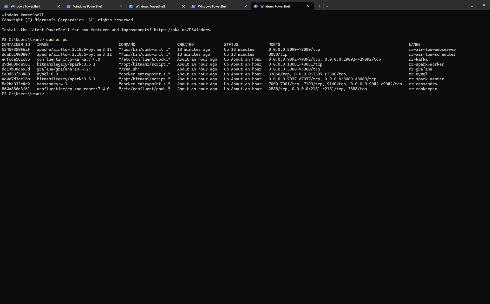
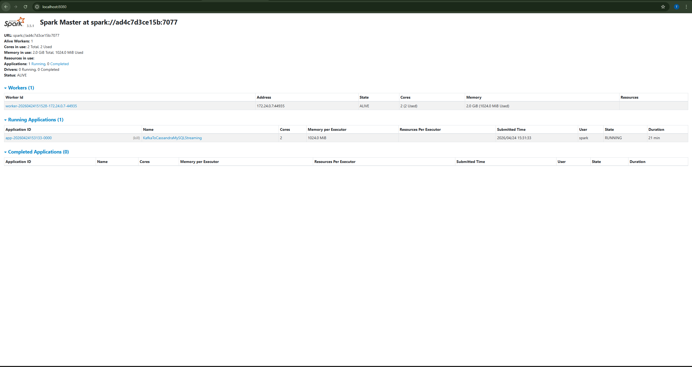
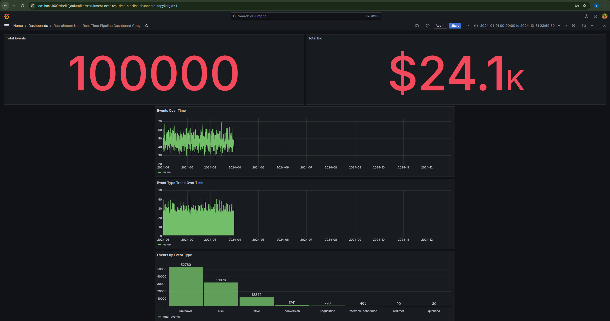
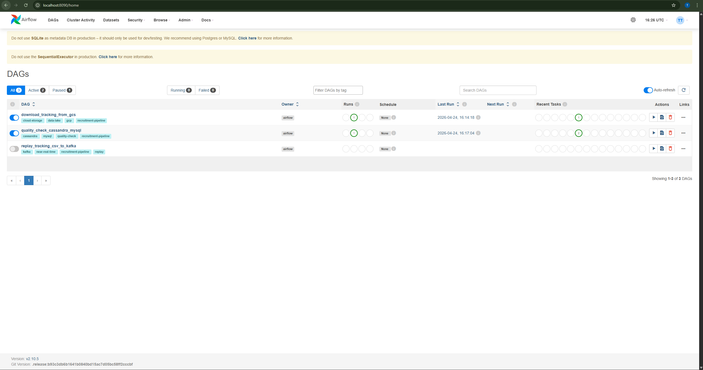
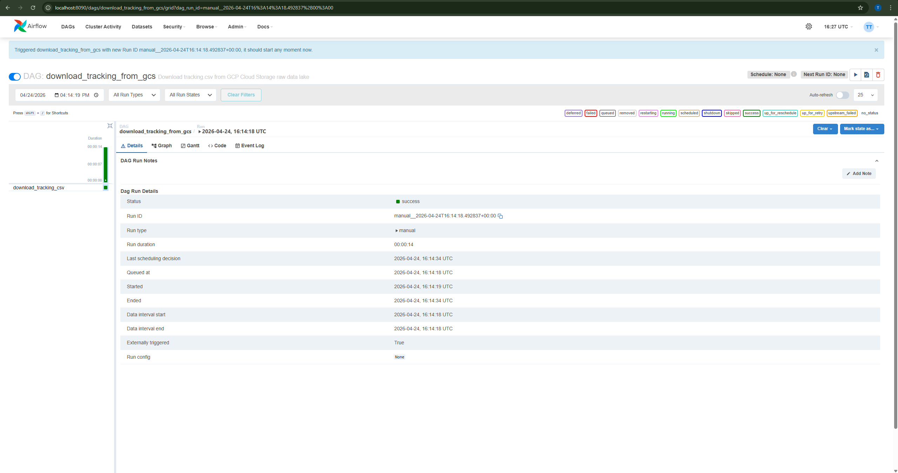
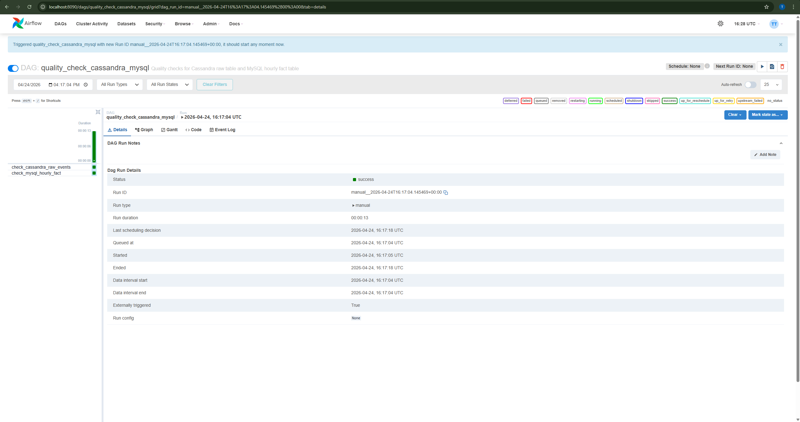
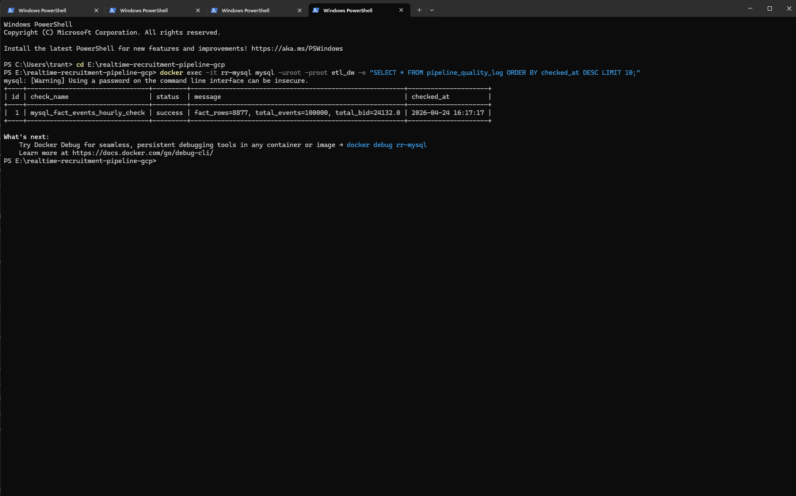

# End-to-End Near Real-Time Recruitment Data Pipeline with Kafka, Spark, Airflow, Docker, and GCP

## Overview

This project is an end-to-end near real-time data engineering pipeline for recruitment tracking events.

The pipeline stores raw tracking data in Google Cloud Storage, replays CSV records into Kafka to simulate near real-time event streaming, processes events with Spark Structured Streaming, stores raw events in Cassandra, writes hourly aggregated facts into MySQL, validates data quality with Airflow, and visualizes business metrics in Grafana.

This project is designed as a junior/middle-level Data Engineer portfolio project.

---

## Architecture



---

## Tech Stack

- Google Cloud Storage
- Docker
- Apache Kafka
- Apache Spark Structured Streaming
- Apache Cassandra
- MySQL
- Apache Airflow
- Grafana
- Python

---

## Key Features

- Stored raw source data in GCP Cloud Storage as a raw data lake.
- Replayed CSV records into Kafka to simulate near real-time event streaming.
- Processed Kafka events with Spark Structured Streaming.
- Stored raw events in Cassandra as a raw event layer.
- Aggregated hourly event metrics into MySQL.
- Orchestrated GCS download, Kafka replay, and data quality checks using Airflow DAGs.
- Visualized recruitment analytics metrics using Grafana.
- Logged data quality check results into MySQL.

---

## Data Flow

```text
tracking.csv
  -> GCP Cloud Storage
  -> Airflow download DAG
  -> Kafka topic: tracking-events
  -> Spark Structured Streaming
  -> Cassandra raw table: logs.tracking_raw
  -> MySQL fact table: fact_events_hourly
  -> Grafana dashboard
  -> Airflow quality checks
```

---

## Project Structure

```text
realtime-recruitment-pipeline-gcp/
├── dags/
│   ├── download_tracking_from_gcs.py
│   ├── replay_tracking_csv_to_kafka.py
│   └── quality_check_cassandra_mysql.py
├── data/
│   └── sample/
│       └── tracking_sample.csv
├── docs/
│   ├── architecture.png
│   ├── gcp-bucket-tracking.png
│   ├── docker-containers.png
│   ├── spark-streaming-ui.png
│   ├── grafana-dashboard.png
│   ├── airflow-dags.png
│   ├── airflow-download-gcs-success.png
│   ├── airflow-quality-check-success.png
│   └── mysql-quality-log.png
├── jobs/
│   ├── replay_tracking_csv_to_kafka.py
│   └── kafka_to_cassandra_mysql_stream.py
├── sql/
│   ├── init_mysql.sql
│   └── init_cassandra.cql
├── docker-compose.yml
├── requirements.txt
├── .env.example
├── .gitignore
└── README.md
```

---

## GCP Cloud Storage Raw Data Lake

The source file `tracking.csv` is uploaded to a Google Cloud Storage bucket and used as the raw data source for the pipeline.



---

## Docker Infrastructure

The main data platform runs locally using Docker Compose.

Services included:

- Kafka
- Zookeeper
- Spark Master
- Spark Worker
- Cassandra
- MySQL
- Grafana
- Airflow Webserver
- Airflow Scheduler



---

## Kafka Event Streaming

The pipeline replays rows from `tracking.csv` into Kafka topic:

```text
tracking-events
```

This step simulates near real-time event ingestion from a source system.

---

## Spark Structured Streaming

Spark Structured Streaming reads JSON events from Kafka and writes data into two sinks:

- Cassandra for raw event storage
- MySQL for hourly aggregated fact tables



---

## Cassandra Raw Layer

Cassandra stores raw tracking events in:

```text
logs.tracking_raw
```

This table acts as the raw event layer for replay, auditing, and downstream processing.

---

## MySQL Data Warehouse Layer

MySQL stores hourly aggregated metrics in:

```text
fact_events_hourly
```

Main columns:

```text
event_date
event_hour
custom_track
total_events
total_bid
updated_at
```

Example quality result:

```text
fact_rows=8877
total_events=100000
total_bid=24132.0
```

---

## Grafana Dashboard

Grafana connects to MySQL and visualizes recruitment event metrics.

Dashboard metrics include:

- Total Events
- Total Bid
- Events Over Time
- Event Type Trend Over Time
- Events by Event Type



---

## Airflow Orchestration

Airflow manages orchestration tasks for the pipeline.

DAGs included:

- `download_tracking_from_gcs`
- `replay_tracking_csv_to_kafka`
- `quality_check_cassandra_mysql`



### GCS Download DAG

This DAG downloads `tracking.csv` from Google Cloud Storage into the local pipeline folder.



### Data Quality Check DAG

This DAG validates that data exists in Cassandra and MySQL, then logs the result into MySQL.



---

## Data Quality Result

The quality check validates:

- Cassandra raw table is not empty.
- MySQL fact table has aggregated rows.
- Total events are greater than zero.
- Quality check result is logged into `pipeline_quality_log`.



---

## How to Run

### 1. Start Docker services

```bash
docker compose up -d
```

### 2. Create Kafka topic

```bash
docker exec -it rr-kafka kafka-topics \
  --bootstrap-server rr-kafka:29092 \
  --create \
  --topic tracking-events \
  --partitions 1 \
  --replication-factor 1
```

### 3. Initialize Cassandra schema

```bash
docker cp sql/init_cassandra.cql rr-cassandra:/init_cassandra.cql
docker exec -it rr-cassandra cqlsh -f /init_cassandra.cql
```

### 4. Run Spark Streaming job

```bash
docker exec -it rr-spark-master spark-submit \
  --master spark://rr-spark-master:7077 \
  --packages org.apache.spark:spark-sql-kafka-0-10_2.12:3.5.1,com.datastax.spark:spark-cassandra-connector_2.12:3.5.1,com.mysql:mysql-connector-j:8.0.33 \
  --conf spark.cassandra.connection.host=rr-cassandra \
  --conf spark.cassandra.connection.port=9042 \
  /opt/project/jobs/kafka_to_cassandra_mysql_stream.py
```

### 5. Replay CSV into Kafka

```bash
python jobs/replay_tracking_csv_to_kafka.py --sleep 0.001
```

### 6. Open UIs

```text
Spark UI   : http://localhost:8080
Grafana    : http://localhost:3000
Airflow    : http://localhost:8090
```

Default Grafana login:

```text
username: admin
password: admin
```

Default Airflow login:

```text
username: admin
password: admin
```

---

## Airflow DAGs

After Airflow is running, open:

```text
http://localhost:8090
```

Then trigger these DAGs manually:

```text
download_tracking_from_gcs
quality_check_cassandra_mysql
```

The replay DAG can be triggered when you want to replay the dataset into Kafka:

```text
replay_tracking_csv_to_kafka
```

Note: Re-running the replay DAG will send the dataset into Kafka again and may increase the aggregated event count in MySQL.

---

## Important Notes

- The full raw dataset is not pushed to GitHub.
- A small sample dataset is available in `data/sample/tracking_sample.csv`.
- GCP service account keys are excluded using `.gitignore`.
- The project runs heavy data services locally with Docker to avoid unnecessary GCP costs.
- GCP is used mainly for Cloud Storage as the raw data lake.

---

## Portfolio Highlights

This project demonstrates:

- GCP Cloud Storage raw data lake integration
- Batch-to-stream simulation using Kafka
- Near real-time processing with Spark Structured Streaming
- Raw event storage with Cassandra
- Data warehouse-style hourly aggregation with MySQL
- Airflow workflow orchestration
- Data quality checks and logging
- Grafana dashboarding
- Dockerized local data platform setup

---

## Author

Tran Thanh Tri  
Data Engineer Portfolio Project
